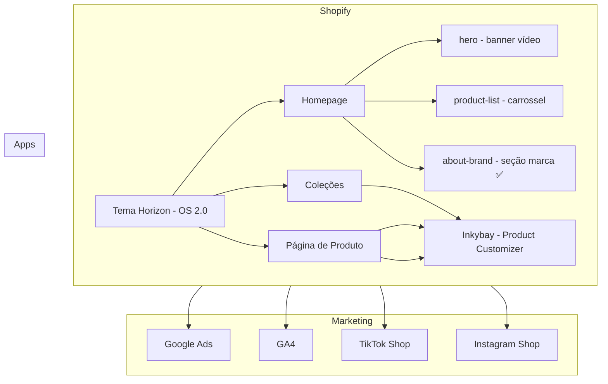

# Graphify — Arquitetura do Projeto

> Atualizar após cada implementação que adicione, remova ou altere componentes, integrações ou fluxos.

## Arquitetura Atual

_Última atualização: 2026-06-18 — seção about-brand criada no tema de desenvolvimento_
