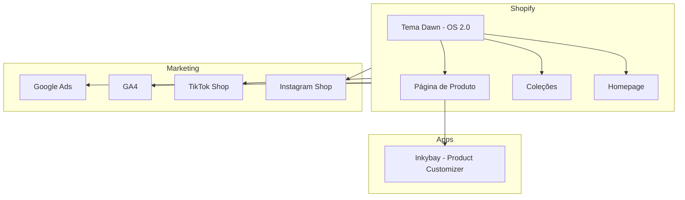

# Graphify — Arquitetura do Projeto

> Atualizar após cada implementação que adicione, remova ou altere componentes, integrações ou fluxos.

## Arquitetura Atual

_Última atualização: setup inicial_
